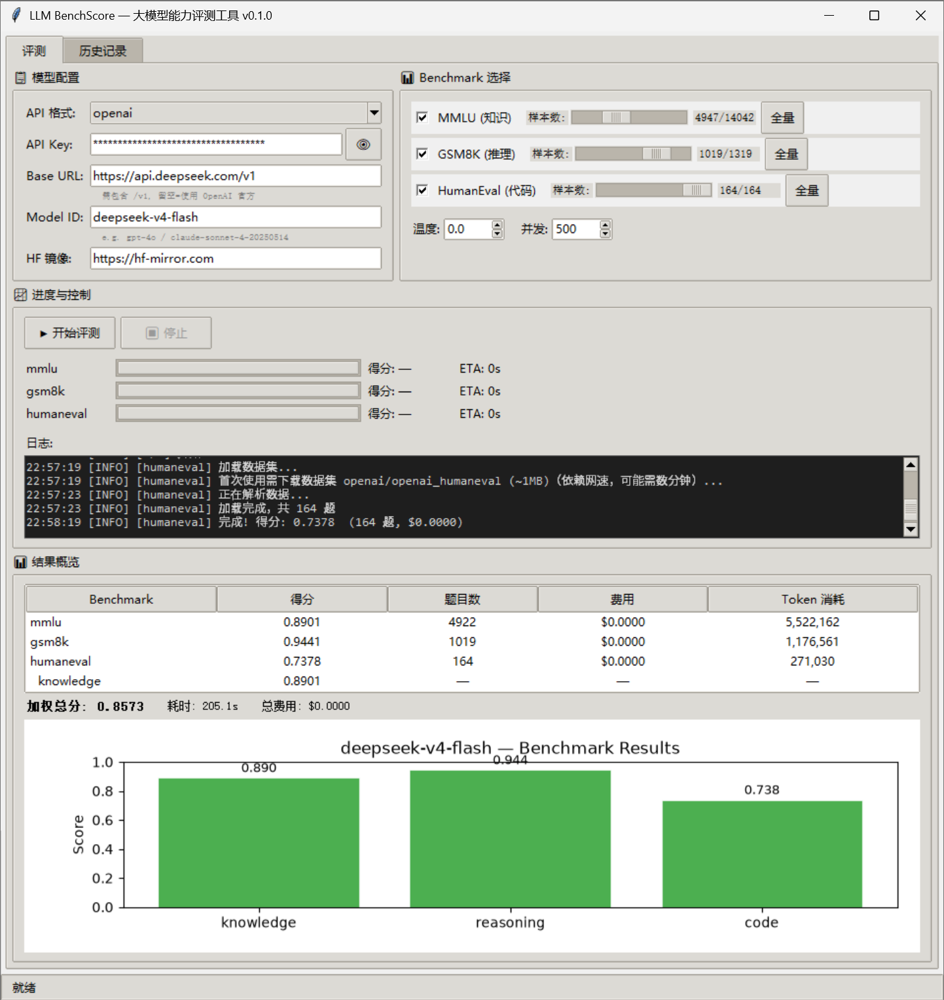

# BenchScore — 轻量化大模型能力评测工具

[](https://www.python.org/)
[](LICENSE)
[](https://github.com/CoffeeCat0667/LLM_BenchScore/releases)

单机运行、tkinter 轻量 GUI、零外部数据库依赖的一站式大模型评测工具。**一键安装，即刻评测**。

---

## 功能概览

### 三大 Benchmark 评测

| Benchmark | 维度 | 题量 | 评测方式 |
|-----------|------|------|----------|
| **MMLU** | 知识 | 14,042 题 (57学科) | 5-shot 多选题 |
| **GSM8K** | 推理 | 1,319 题 | 5-shot 链式推理 (CoT) |
| **HumanEval** | 代码 | 164 题 | 0-shot Python 代码生成 + 沙箱执行 |

### 六项站点诊断

| 测试项 | 说明 |
|--------|------|
| **站点响应延迟** | 3 次 API 调用取平均 RTT |
| **协议一致性** | HTTP 状态码 + Content-Type 校验 |
| **响应结构** | JSON 字段完整性验证 |
| **型号特征校验** | 模型自报身份与配置比对 |
| **首字响应时间 (TTFT)** | 流式请求测量首个 token 延迟 |
| **隐藏提示词检测** | 3 种注入探针检测 System Prompt 泄露 |

### 核心特性

- **双模式运行**：GUI 桌面界面 + CLI 命令行
- **多协议支持**：OpenAI / Anthropic / 兼容 OpenAI 协议（DeepSeek、Qwen、vLLM 等）
- **灵活采样**：全量 / 自定义采样数量
- **实时反馈**：并发进度条 + 预估耗时 + 费用预告
- **JSON 结果存储**：轻量、可复制、可二次分析
- **HuggingFace 镜像**：内置 hf-mirror.com 支持，国内网络友好
- **数据集预加载**：启动时检查缓存，一键下载

---

## 评测截图

以下是 **deepseek-v4-flash-0731** 的评测结果：



---

## 环境要求

| 组件 | 最低版本 |
|------|----------|
| Python | **3.12+** |
| 操作系统 | Windows / macOS / Linux |
| 网络 | 需访问 LLM API 端点 + HuggingFace 镜像 |

## 安装

### 1. 克隆仓库

```bash
git clone https://github.com/CoffeeCat0667/LLM_BenchScore.git
cd LLM_BenchScore
```

### 2. 新建 Python 虚拟环境（推荐）

虚拟环境将项目依赖与系统全局 Python 环境隔离，避免包版本互相污染。

**Windows (PowerShell):**
```powershell
python -m venv venv
```

**Windows (CMD):**
```cmd
python -m venv venv
```

**macOS / Linux:**
```bash
python3 -m venv venv
```

> `venv` 为环境目录名，可按需自定义（如 `.venv`）。

### 3. 进入虚拟环境

**Windows (PowerShell):**
```powershell
.\venv\Scripts\Activate.ps1
```

**Windows (CMD):**
```cmd
venv\Scripts\activate.bat
```

**macOS / Linux:**
```bash
source venv/bin/activate
```

进入成功后，命令行提示符前会出现 `(venv)` 前缀，此时 `python` 与 `pip` 均指向虚拟环境。

### 4. 安装依赖

```bash
pip install -e .
```

这会自动安装所有必需依赖：

| 包 | 用途 |
|----|------|
| `openai` | OpenAI / 兼容协议的 API 调用 |
| `anthropic` | Anthropic Claude API 调用 |
| `datasets` | HuggingFace 数据集加载 |
| `httpx` | HTTP 客户端 |
| `pyyaml` | 配置文件解析 |
| `matplotlib` | 结果图表渲染 |

> **注意**：`tkinter` 是 Python 内置模块，无需单独安装。

### 5. 验证安装

```bash
python -c "from benchscore import __version__; print(__version__)"
# 输出: 0.1.1
```

### 6. 退出虚拟环境

```bash
deactivate
```

### 7. 删除虚拟环境

退出虚拟环境后，直接删除环境目录即可：

**Windows (PowerShell):**
```powershell
Remove-Item -Recurse -Force venv
```

**Windows (CMD):**
```cmd
rmdir /s /q venv
```

**macOS / Linux:**
```bash
rm -rf venv
```

> 删除后如需重新使用，重复第 2 步重新新建即可。

---

## 快速开始

### GUI 模式（推荐）

```bash
python -m gui.app
```

首次启动会弹出**数据集准备窗口**，建议点击"下载未缓存的"提前下载数据集：

- MMLU (~1.2GB)
- GSM8K (~8MB)
- HumanEval (~1MB)

下载一次后永久缓存，后续启动秒开。

> 国内用户默认使用 `hf-mirror.com` 镜像，无需额外配置。

### CLI 模式

```bash
# 查看可用 Benchmark
benchscore list

# 运行 MMLU 评测（采样 1000 题）
benchscore run gpt-4o -b mmlu -k sk-your-api-key

# 运行多个 Benchmark
benchscore run gpt-4o -b mmlu,gsm8k,humaneval -k sk-xxx

# 指定并发数和采样量
benchscore run deepseek-chat -b mmlu -n 500 -c 20 \
  -k sk-xxx --base-url https://api.deepseek.com/v1
```

---

## 配置指南

### 填入 API Key

三种方式（优先级从高到低）：

1. **GUI 直接输入**（会话级，不落盘）
2. **环境变量**：
   ```bash
   # Windows PowerShell
   $env:BENCHSCORE_OPENAI_API_KEY="sk-your-key"

   # macOS / Linux
   export BENCHSCORE_OPENAI_API_KEY="sk-your-key"
   ```
3. **配置文件** `configs/default.yaml`

### 自定义 API 端点

在 GUI 的 **Base URL** 栏填写（**必须包含 `/v1` 后缀**）：

| 服务商 | Base URL |
|--------|----------|
| OpenAI 官方 | 留空 |
| DeepSeek | `https://api.deepseek.com/v1` |
| 本地 vLLM | `http://localhost:8000/v1` |
| 本地 Ollama | `http://localhost:11434/v1` |

### 模型 ID 示例

| 模型 | Model ID |
|------|----------|
| GPT-4o | `gpt-4o` |
| GPT-4o Mini | `gpt-4o-mini` |
| Claude Sonnet 4 | `claude-sonnet-4-20250514` |
| Claude Opus 4 | `claude-opus-4-20250514` |
| DeepSeek V3 | `deepseek-chat` |
| DeepSeek R1 | `deepseek-reasoner` |

### HuggingFace 镜像

默认使用 `hf-mirror.com`，国内免代理。如需切换：

```bash
export HF_ENDPOINT="https://huggingface.co"   # 官方源
```

---

## 完整测试流程

以 DeepSeek 为例：

1. **启动 GUI**
   ```bash
   python -m gui.app
   ```

2. **配置模型**（在"评测"标签页左侧面板）

   | 字段 | 填写 |
   |------|------|
   | API 格式 | `openai` |
   | API Key | 你的 DeepSeek API Key |
   | Base URL | `https://api.deepseek.com/v1` |
   | Model ID | `deepseek-chat` |

3. **选择 Benchmark** — 勾选 MMLU / GSM8K / HumanEval，调整采样数

4. **点击 ▶ 开始评测**

5. **站点诊断** — 切换到"站点测试"标签页，点击 🔍 开始测试，验证 API 端点健康状态

---

## 项目结构

```
LLM_BenchScore/
├── benchscore/                    # 核心 Python 包
│   ├── adapters/                  # LLM API 适配器
│   │   ├── base.py                #   抽象基类 + 批量并发 + 重试逻辑
│   │   ├── openai.py              #   OpenAI / 兼容协议
│   │   ├── anthropic.py           #   Anthropic Claude
│   │   └── openai_compatible.py   #   第三方兼容端点
│   ├── benchmarks/                # 多维度评测
│   │   ├── base.py                #   统一流水线抽象
│   │   ├── mmlu.py                #   57 学科知识评测
│   │   ├── gsm8k.py               #   数学推理评测
│   │   └── humaneval.py           #   代码生成评测
│   ├── dataset_adapters/          # HuggingFace 数据格式转换
│   ├── metrics/                   # 评分算法
│   │   ├── exact_match.py         #   精确匹配 + 多选题答案提取
│   │   ├── math_grader.py         #   数学答案提取 + 数值比对
│   │   └── code_executor.py       #   subprocess 沙箱代码执行
│   ├── site_tester.py             # 站点诊断引擎（6 项测试）
│   ├── runner.py                  # 异步并发评测调度
│   ├── scorer.py                  # 多维度加权评分
│   ├── store.py                   # JSON 文件结果存储
│   └── cli.py                     # CLI 命令行入口
├── gui/                           # tkinter 桌面界面
│   ├── app.py                     #   主窗口（多标签页）
│   ├── splash.py                  #   启动前数据集预加载
│   ├── model_panel.py             #   模型配置面板
│   ├── benchmark_panel.py         #   Benchmark 选择面板
│   ├── run_panel.py               #   运行控制 + 实时进度 + 日志
│   ├── result_panel.py            #   结果展示 + 图表
│   ├── site_test_panel.py         #   站点测试面板
│   └── dialogs.py                 #   弹窗（费用确认等）
├── configs/                       # 默认配置文件
├── results/                       # JSON 结果输出目录
└── pyproject.toml                 # 项目元数据
```

---

## 扩展新 Benchmark

1. 创建 `benchscore/benchmarks/your_bench.py`，继承 `BaseBenchmark`
2. 创建对应的 `benchscore/dataset_adapters/your_adapter.py`
3. 在 `benchscore/benchmarks/__init__.py` 中注册

```python
from benchscore.benchmarks.base import BaseBenchmark

class YourBenchmark(BaseBenchmark):
    name = "your_bench"
    dimension = "knowledge"
    dataset_id = "your/dataset_id"
    sample_size = 500

    def build_prompt(self, sample) -> str:
        return f"Question: {sample.prompt}\nAnswer:"

    def score(self, sample, response: str) -> dict:
        correct = (response.strip() == sample.expected_answer)
        return {"correct": correct, "id": sample.id, "group": "default"}
```

---

## 常见问题

**Q: 首次评测卡在"加载数据集"？**  
A: 首次需从 HuggingFace 下载数据集（MMLU ~1.2GB），请耐心等待。后续运行从缓存加载，秒级完成。

**Q: 全部 API 调用失败？**  
A: 检查 Base URL 是否遗漏 `/v1` 后缀；或使用"站点测试"标签页运行诊断定位问题。

**Q: 进度条得分始终显示 `—`？**  
A: 正常现象——评分在全部 API 调用完成后统一计算，进度回调期间无法实时得知正确率。

**Q: tkinter 报错 `No module named '_tkinter'`？**  
A: 部分 Linux 发行版需单独安装：`sudo apt install python3-tk` (Ubuntu) 或 `sudo yum install python3-tkinter` (CentOS)。

---

## License

本项目采用 [Apache License 2.0](LICENSE)。
